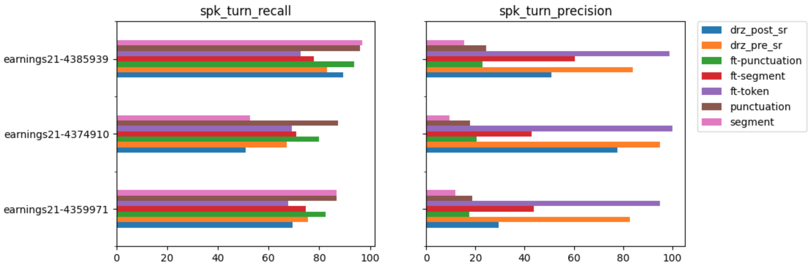

# tinyDiarize 🐥🗣️

This is a minimal extension of OpenAI's [Whisper](https://github.com/openai/whisper) models that adds speaker diarization to transcripts via special `<|speakerturn|>` tokens. It can be used as a drop-in replacement for `whisper.transcribe` with the same API, and no extra dependencies.


## Quickstart 

Simply run the original setup and use the `small.en-tdrz` model instead of `small.en`. That's it! 🎉

```
pip install -e .
whisper AUDIO --model small.en-tdrz SAME_CLI_ARGS
```

*(the code will auto-download the finetuned checkpoint, see  `whisper.__init__` for info)*

You can try it out on videos from YouTube using this notebook
[](https://colab.research.google.com/github/akashmjn/tinyDiarize/master/notebooks/Demo_YouTube.ipynb)

## Why do this?

- *Speaker diarization* is the task of identifying who spoke when in an audio recording. Along with spoken content, it is a key part of creating who-spoke-what transcripts, such as those for podcasts.
- *tinyDiarize*  aims to be a minimal, interpretable  extension of original Whisper models (inspired by [minGPT](https://github.com/karpathy/minGPT)) that keeps extra dependencies to a minimum. 
- By extending models with special `<|speakerturn|>` tokens (first introduced in [Kanda et al.](https://arxiv.org/abs/2003.12687)) a key part of the task can be solved cleanly, effectively, and at no extra cost. Stay tuned for details in an upcoming blog post! 📺
- The simplicity (same structure checkpoint, few line edits of inference code) has the added benefit of ease of integration into existing ports like [whisper.cpp](https://github.com/ggerganov/whisper.cpp) that runs on MacBooks and iPhones.
- By also releasing reproducible finetuning, we hope to enable others (or even OpenAI themselves!) to improve performance and extend support (multilingual, speech translation etc.)

## More info 
- Whisper `small.en` checkpoints were finetuned using HuggingFace [Transformers](https://github.com/huggingface/transformers) and [Datasets](https://github.com/huggingface/datasets). This could be done relatively cheaply with just 30mins of 1 GPU training :)
- Code will be released shortly for full reproducibility.
- An important contribution of this repo is also a scoring/analysis setup using [revdotcom/fstalign](https://github.com/revdotcom/fstalign) that allows for interpretable error inspection and side-by-side analysis.
- A blog post and accompanying Jupyter notebooks will be released soon with more details.



## Gotchas

Note that this is still WIP and there are a few things to be aware of:
- This was done only for the `small.en` English model mainly to demonstrate feasibility. 
- Initial tests show it's possible to have minimal impact on the original accuracy (WER) of models. Just putting this in gotchas here until a more thorough analysis is done.
- Only local diarization is handled so far (speaker turns). A (TBD) clustering step will be needed to group speaker turns into speaker A, B, C etc.
- Stuff is still quite hacky and subject to change, so bear with us until things are released! 🙏

# Whisper

[[Blog]](https://openai.com/blog/whisper)
[[Paper]](https://arxiv.org/abs/2212.04356)
[[Model card]](https://github.com/openai/whisper/blob/main/model-card.md)
[[Colab example]](https://colab.research.google.com/github/openai/whisper/blob/master/notebooks/LibriSpeech.ipynb)

Whisper is a general-purpose speech recognition model. It is trained on a large dataset of diverse audio and is also a multitasking model that can perform multilingual speech recognition, speech translation, and language identification.

## Approach


A Transformer sequence-to-sequence model is trained on various speech processing tasks, including multilingual speech recognition, speech translation, spoken language identification, and voice activity detection. These tasks are jointly represented as a sequence of tokens to be predicted by the decoder, allowing a single model to replace many stages of a traditional speech-processing pipeline. The multitask training format uses a set of special tokens that serve as task specifiers or classification targets.


## Setup

We used Python 3.9.9 and [PyTorch](https://pytorch.org/) 1.10.1 to train and test our models, but the codebase is expected to be compatible with Python 3.8-3.10 and recent PyTorch versions. The codebase also depends on a few Python packages, most notably [HuggingFace Transformers](https://huggingface.co/docs/transformers/index) for their fast tokenizer implementation and [ffmpeg-python](https://github.com/kkroening/ffmpeg-python) for reading audio files. You can download and install (or update to) the latest release of Whisper with the following command:

    pip install -U openai-whisper

Alternatively, the following command will pull and install the latest commit from this repository, along with its Python dependencies:

    pip install git+https://github.com/openai/whisper.git 

To update the package to the latest version of this repository, please run:

    pip install --upgrade --no-deps --force-reinstall git+https://github.com/openai/whisper.git

It also requires the command-line tool [`ffmpeg`](https://ffmpeg.org/) to be installed on your system, which is available from most package managers:

```bash
# on Ubuntu or Debian
sudo apt update && sudo apt install ffmpeg

# on Arch Linux
sudo pacman -S ffmpeg

# on MacOS using Homebrew (https://brew.sh/)
brew install ffmpeg

# on Windows using Chocolatey (https://chocolatey.org/)
choco install ffmpeg

# on Windows using Scoop (https://scoop.sh/)
scoop install ffmpeg
```

You may need [`rust`](http://rust-lang.org) installed as well, in case [tokenizers](https://pypi.org/project/tokenizers/) does not provide a pre-built wheel for your platform. If you see installation errors during the `pip install` command above, please follow the [Getting started page](https://www.rust-lang.org/learn/get-started) to install Rust development environment. Additionally, you may need to configure the `PATH` environment variable, e.g. `export PATH="$HOME/.cargo/bin:$PATH"`. If the installation fails with `No module named 'setuptools_rust'`, you need to install `setuptools_rust`, e.g. by running:

```bash
pip install setuptools-rust
```


## Available models and languages

There are five model sizes, four with English-only versions, offering speed and accuracy tradeoffs. Below are the names of the available models and their approximate memory requirements and relative speed. 


|  Size  | Parameters | English-only model | Multilingual model | Required VRAM | Relative speed |
|:------:|:----------:|:------------------:|:------------------:|:-------------:|:--------------:|
|  tiny  |    39 M    |     `tiny.en`      |       `tiny`       |     ~1 GB     |      ~32x      |
|  base  |    74 M    |     `base.en`      |       `base`       |     ~1 GB     |      ~16x      |
| small  |   244 M    |     `small.en`     |      `small`       |     ~2 GB     |      ~6x       |
| medium |   769 M    |    `medium.en`     |      `medium`      |     ~5 GB     |      ~2x       |
| large  |   1550 M   |        N/A         |      `large`       |    ~10 GB     |       1x       |

The `.en` models for English-only applications tend to perform better, especially for the `tiny.en` and `base.en` models. We observed that the difference becomes less significant for the `small.en` and `medium.en` models.

Whisper's performance varies widely depending on the language. The figure below shows a WER (Word Error Rate) breakdown by languages of the Fleurs dataset using the `large-v2` model. More WER and BLEU scores corresponding to the other models and datasets can be found in Appendix D in [the paper](https://arxiv.org/abs/2212.04356). The smaller, the better.


## Command-line usage

The following command will transcribe speech in audio files, using the `medium` model:

    whisper audio.flac audio.mp3 audio.wav --model medium

The default setting (which selects the `small` model) works well for transcribing English. To transcribe an audio file containing non-English speech, you can specify the language using the `--language` option:

    whisper japanese.wav --language Japanese

Adding `--task translate` will translate the speech into English:

    whisper japanese.wav --language Japanese --task translate

Run the following to view all available options:

    whisper --help

See [tokenizer.py](https://github.com/openai/whisper/blob/main/whisper/tokenizer.py) for the list of all available languages.


## Python usage

Transcription can also be performed within Python: 

```python
import whisper

model = whisper.load_model("base")
result = model.transcribe("audio.mp3")
print(result["text"])
```

Internally, the `transcribe()` method reads the entire file and processes the audio with a sliding 30-second window, performing autoregressive sequence-to-sequence predictions on each window.

Below is an example usage of `whisper.detect_language()` and `whisper.decode()` which provide lower-level access to the model.

```python
import whisper

model = whisper.load_model("base")

# load audio and pad/trim it to fit 30 seconds
audio = whisper.load_audio("audio.mp3")
audio = whisper.pad_or_trim(audio)

# make log-Mel spectrogram and move to the same device as the model
mel = whisper.log_mel_spectrogram(audio).to(model.device)

# detect the spoken language
_, probs = model.detect_language(mel)
print(f"Detected language: {max(probs, key=probs.get)}")

# decode the audio
options = whisper.DecodingOptions()
result = whisper.decode(model, mel, options)

# print the recognized text
print(result.text)
```

## More examples

Please use the [🙌 Show and tell](https://github.com/openai/whisper/discussions/categories/show-and-tell) category in Discussions for sharing more example usages of Whisper and third-party extensions such as web demos, integrations with other tools, ports for different platforms, etc.


## License

Whisper's code and model weights are released under the MIT License. See [LICENSE](https://github.com/openai/whisper/blob/main/LICENSE) for further details.
