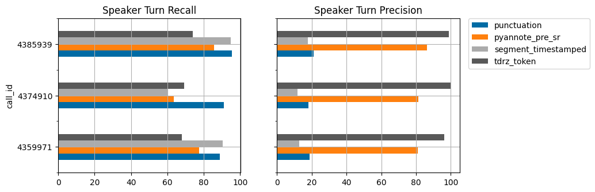

# tinydiarize dev 🔨📊

This directory contains tools to aid development and analysis. This can be used to reproduce results and take a closer look at analysis from the blog post. Contents:
- [score.py](score.py) to measure and compare accuracy on your own data with easy to interpret metrics (WER, speaker turn precision/recall).
- [run_pipelines.py](scripts/run_pipelines.py) shows how to run and compare various diarization pipelines.
- [analysis.ipynb](https://nbviewer.org/github/akashmjn/tinydiarize/blob/main/tdrz_dev/notebooks/analysis.ipynb) walks through a comparison of various pipelines with a deep dive to understand sources of errors.
- Code to reproduce finetuning will also be released shortly.

It has extra [setup and dependencies](#setup) that are not required for inference.

## Analysis 

In the accompanying notebook [analysis.ipynb](https://nbviewer.org/github/akashmjn/tinydiarize/blob/main/tdrz_dev/notebooks/analysis.ipynb) ([](https://colab.research.google.com/github/akashmjn/tinydiarize/blob/main/tdrz_dev/notebooks/analysis.ipynb)), we show that:
- Whisper models already have a good internal representation of speaker turns via both acoustic and semantic cues.
- Their placement of `punctuation` tokens appears to be very consistent with speaker turns (high recall).
- Whisper's time segments `segment_timestamped` (used for clustering [here](https://huggingface.co/spaces/vumichien/Whisper_speaker_diarization)) are less consistent.
- Acoustic embedding-based diarization methods like [`pyannote_pre_sr`](https://github.com/pyannote/pyannote-audio) perform well overall, but struggle with short segments & quick speaker turns. This leaves a gap with the best individual precision or recall.
- `tdrz_token` shows that we can extract Whisper's speaker representations cheaply, and with small word error rate impact.
- With improvements to finetuning, strong performance can be expected as it can use both voice and semantic context to tell speakers apart, which is a unique benefit of this approach.

*The following numbers are scored on a set of [3 earnings calls](https://github.com/revdotcom/speech-datasets/tree/main/earnings21) (~23k words, ~300 spk turns). Qualitative analysis/error inspection helps us draw these conclusions.*

|model|small.en| | |small.en-tdrz|
|:----|:----|:----|:----|:----|
|method|punctuation|pyannote_pre_sr|segment_timestamped|tdrz_token|
|metric| | | | |
|spk_turn_precision|19.5|83.4|14.5|97.7|
|spk_turn_recall|92.0|78.4|86.7|70.8|
|wer_overall|11.0|12.9|11.0|10.3|
|wer_speaker_switch|15.0|23.11|15.0|15.5|



## Runtime cost estimate

Local diarization done by `tdrz` comes at a marginal added cost. If we account for an additional clustering step (implemented [here](scripts/diarize_post_sr.py)), this can still be quite cheap overall.

|Stage|Runtime (s)|Extra cost (%)|
|:----|:----|:----|
|Whisper.transcribe|121.2|-|
|Pyannote diarization|56.6|47%|
|Clustering whisper time segments|3.4|3%|
|Whisper.transcribe (tdrz)|131.5|8%|

*These numbers were tested using the earnings21-4374910 call (33.8 min) on a Quadro RTX 5000 GPU. Whisper is run with beam_size=4 and condition_on_previous_text=True.*

## Setup

You'll need to setup the following dependencies.

1. In a fresh python environment (I used python=3.9), run the following (from the root of the github repo):
```
    pip install -e .                       
    cd tdrz_dev
    pip install -r extra_requirements.txt
```
2. `docker pull revdotcom/fstalign`. This installs [revdotcom/fstalign](https://github.com/revdotcom/fstalign) for scoring
3. [Pyannote](https://github.com/pyannote/pyannote-audio) consent prerequisites:
    - visit hf.co/pyannote/speaker-diarization and accept user conditions
    - visit hf.co/pyannote/segmentation and accept user conditions
    - visit hf.co/settings/tokens to create an access token and save it to a text file at `tdrz_dev/scripts/HF_TOK.txt`.
